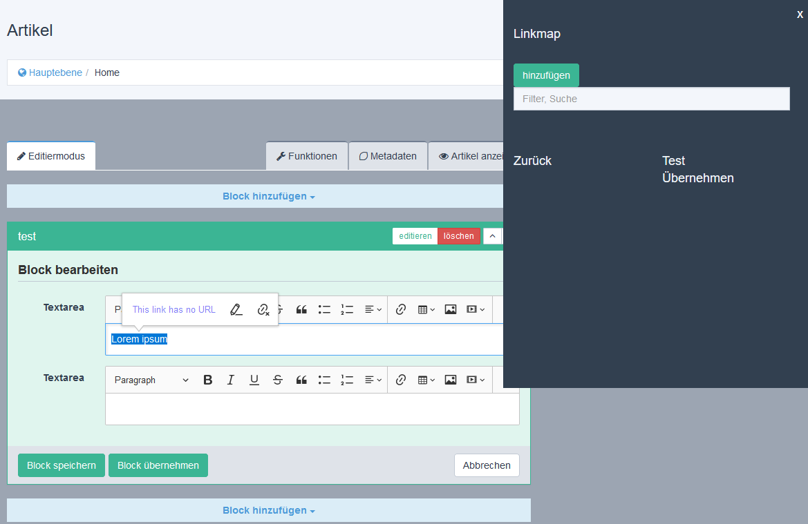

# linkmap_concept
This is a Redaxo 5 concept addon for a new linkmap widget.

## Features
- linkmap widget

## Requirements
- cke5

## Setup
1. Copy files to addon folder and install through backend

## Usage
You can use the linkmap widget in the backend with the cke5-editor
